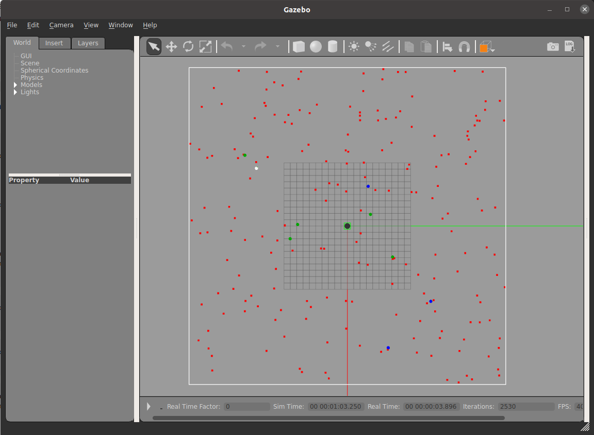

## INTRODUCTION
This repository contains all files necessary for running the RepAtt and Random Walk swarm foraging algorithms.

## DEPENDENCIES
* An Ubuntu16.04 (or more recent version) is recommended for setting up and running the simulation.
* *Singularity* was used to containerize the environment for building and visualising the simulation. Instruction for installing Singularity and its dependencies for Linux (including links to settingi it up on Mac and Windows) are found at this link: https://sylabs.io/guides/3.7/user-guide/quick_start.html
* *Git* version control system is needed to navigate different branches of the source code. More instructions on setting up Git for different platforms are at this link: https://git-scm.com/

## SETUP FILES
Once Git and Singularity are set up correctly, the next step is to download the source files from the Github repository and checkout/switch to the desired branch.

1. From the terminal, clone the swarm_sim repository using

    `git clone https://github.com/elcymon/swarm_sim.git`

1. Change directory to the just downloaded swarm_sim repository 

    `cd swarm_sim`
1. The repository contains a Singularity recipe file (similar to Dockerfile for docker), which will be used to create the simulating the swarm algorithm using Gazebo simulator and build environment. Build the Singularity container using: 

    `sudo singularity build 20190708-libgazebo7-xenial.simg Singularity` 

    This creates a `20190708-libgazebo7-xenial.simg` file which contains the Gazebo simulator, python3 and cmake build setup for compiling Gazebo simulation libraries.
1. To run a sample simulation use: 

    `./mult_div_submission_loop.sh 0 1 1 Uniform var_qsize params/var_qsize.csv 0 9`

    (NB: You will need to zoom out to get a complete view of the simulation world. You can use the scroll on your mouse to do that. http://gazebosim.org/hotkeys)

    Sample simulation view in progress is shown in the figure below

    

1. To (re)build the project, run 
    
    `singularity exec 20190708-libgazebo7-xenial.simg ./build.sh`

## TODO
1. description of different command line parameters and files
2. Information on algorithm parameters used for the simulation.